<div align="center">

# PERJURY

### Autonomous adversarial test hardening for Python

**Your CI is green. PERJURY finds what your tests never proved.**

[](https://github.com/reverez/Tech-Europe-2026-PERJURY/actions/workflows/ci.yml)


</div>

PERJURY is an autonomous test-hardening system for Python/pytest projects. It uses **Google Gemini** to propose semantically meaningful code mutations and targeted regression tests, **Modal** to execute each trial in isolated Sandboxes, and **deterministic pytest evidence** to decide what is actually true.

The core rule is deliberately simple:

> **The model proposes. Execution proves.**

An LLM can suggest a mutation, explain a survivor, or generate a test. It can never declare that test correct. A candidate is accepted only when the same generated test passes against the original program and fails against the surviving mutant.

---

## Why PERJURY?

A green CI pipeline proves that the tests you wrote are passing. It does not prove that the important behaviours you forgot to test are protected.

PERJURY attacks that gap by making small, plausible semantic changes to the implementation and asking a harder question:

**Would the existing suite notice if this behaviour changed?**

If a mutation survives, PERJURY treats it conservatively as a **potential test gap**. It then generates a focused regression test and verifies that test in two isolated execution worlds before it can be accepted.

---

## How it works

1. **Establish a green baseline** against an immutable, sanitized workspace snapshot.
2. **Ask Gemini for semantic mutations** using bounded source and test context.
3. **Validate and safely materialize** those mutations with typed Pydantic contracts, exact anchors, path restrictions, deduplication, and compile checks.
4. **Execute mutants concurrently in Modal Sandboxes** and classify real pytest outcomes as killed, survived, invalid, timeout, or infrastructure error.
5. **Analyze a useful survivor and generate a pytest candidate** without allowing the model to decide correctness.
6. **Verify the candidate in two worlds**, then re-run the same mutation batch to measure whether the suite actually improved.

### Verification invariant

A generated regression test is **VERIFIED** only when:

```text
original + generated test  => PASS
mutant   + generated test  => TEST_FAIL
```

Collection failures, dependency errors, timeouts, command failures, and infrastructure failures never count as proof.

---

## Architecture

```mermaid
flowchart LR
    A[Sanitized workspace] --> B[Green baseline]
    B --> C[Gemini mutation planner]
    C --> D[Pydantic validation]
    D --> E[Safe mutation materialization]
    E --> F[Modal bounded fan-out]
    F --> G{pytest outcome}
    G -->|TEST_FAIL| H[Killed]
    G -->|PASS| I[Survived]
    G -->|Invalid / timeout / infra| J[Excluded, retained as evidence]
    I --> K[Gemini survivor analysis]
    K --> L[Generated pytest candidate]
    L --> M[Original + candidate]
    L --> N[Mutant + candidate]
    M --> O{PASS?}
    N --> P{TEST_FAIL?}
    O -->|yes| Q[Deterministic judge]
    P -->|yes| Q
    Q -->|both true| R[VERIFIED]
    R --> S[Re-score same mutation batch]
    S --> T[Evidence bundle + API + UI]
```



The implementation is driven by one typed orchestration entrypoint, `perjury.orchestrator.run_perjury`. The FastAPI layer exposes the run state and ordered SSE events to a zero-build dashboard served at `/demo`.

### Trust boundaries

| Layer | Responsibility | Allowed to decide correctness? |
| --- | --- | --- |
| **Google Gemini** | mutation proposals, survivor analysis, regression-test generation | No |
| **Pydantic / PydanticAI** | typed model boundaries and validation | Shape only |
| **Modal** | isolated concurrent execution | No |
| **pytest + deterministic verifier** | PASS / TEST_FAIL evidence, verdicts, mutation score | **Yes** |

---

## Proven results

PERJURY keeps deterministic rehearsal evidence separate from fully live model runs. Different mutation batches are never combined into one headline score.

| Evidence | Result |
| --- | --- |
| **Canonical reproducible rehearsal** — fixed 8-mutant refund batch, mocked model boundaries, real Modal execution | 5 killed / 3 survived → **0.625**; generated test VERIFIED; same-batch re-score 6 / 2 → **0.750** |
| **Fully live Gemini + Modal** — `run-2e7df7037679` | **VERIFIED in 54.067 s**; same-batch score **0.000 → 0.125**; zero leaked Sandboxes |
| **Live safety behavior** — two further Gemini + Modal runs | Both correctly **rejected** because the generated test failed against the original program; zero leaked Sandboxes |

The validated executable backend is pinned at `1429b6a47b0edd883807f74c631077405b2707b7`. Changes after that validation point are documentation and dashboard presentation; the execution pipeline, API contract, scoring semantics, and verification rule are unchanged. Deterministic CI runs on every push and pull request.

For full provenance, timings, run IDs, and rehearsal procedure, see [docs/DEMO_RUNBOOK.md](docs/DEMO_RUNBOOK.md).

---

## Quick start

### Requirements

- Python **3.12.x**
- Git
- A Modal account for isolated live execution
- A Google API key for the fully live Gemini path

### Install

```bash
git clone https://github.com/reverez/Tech-Europe-2026-PERJURY.git
cd Tech-Europe-2026-PERJURY

bash scripts/bootstrap.sh
source .venv/bin/activate
```

`bootstrap.sh` creates the virtual environment, installs pinned dependencies, creates `.env` from `.env.example`, and runs the deterministic local gate. It does not call external services.

### Configure the live path

Add your Google API key to `.env`:

```dotenv
GOOGLE_API_KEY=...
PERJURY_MODEL=google:gemini-3.8-flash
PERJURY_MUTATION_COUNT=8
```

Then authenticate Modal:

```bash
modal setup
```

### Run the application

```bash
python scripts/preflight.py
python -m uvicorn perjury.api:app --port 8000
```

Open:

```text
http://127.0.0.1:8000/demo
```

Press **Run PERJURY** to start the live closed loop.

---

## Useful commands

```bash
# Deterministic quality gate: lint + test suite
bash scripts/check.sh

# Live readiness checks by subsystem
python scripts/preflight.py

# Fully live application
python -m uvicorn perjury.api:app --port 8000

# No-credential UI / orchestration rehearsal
python scripts/serve_demo.py --mock-models

# Canonical smoke: deterministic model fixtures + real Modal execution
python scripts/closed_loop_smoke.py --mock-models

# Real-browser smoke against the real API
python scripts/browser_smoke.py
```

The UI-only replay at `/demo?adapter=mock` is permanently labelled **SIMULATED** and is never presented as execution evidence.

---

## API

| Method | Endpoint | Purpose |
| --- | --- | --- |
| `POST` | `/api/runs` | Start a hardening run |
| `GET` | `/api/runs/{id}` | Read the authoritative typed run snapshot |
| `GET` | `/api/runs/{id}/events` | Stream ordered SSE events with resume support |
| `GET` | `/api/runs/{id}/evidence` | Download the sanitized run evidence bundle |
| `GET` | `/health` | Process health |

See [docs/API_CONTRACT.md](docs/API_CONTRACT.md) for the complete contract.

---

## Evidence and isolation

Each run produces a sanitized evidence bundle at:

```text
.perjury/runs/<run_id>/evidence.json
```

PERJURY is designed so execution evidence can be inspected without exposing credentials. Workspaces are manifest-driven, secrets and runtime directories are excluded, source mutations are restricted to an explicit implementation allowlist, generated tests are created as new files rather than overwriting existing tests, captured output is bounded, and Modal Sandboxes block outbound network access by default.

Mutation scores are computed only from valid **killed + survived** outcomes. Invalid mutations, timeouts, and infrastructure failures remain visible in evidence but are excluded from the denominator. If there is no valid outcome, the score is reported as unavailable rather than as 0%.

---

## Repository structure

```text
perjury/
├── orchestrator.py     # typed closed-loop state machine
├── contracts.py        # shared execution/model/API contracts
├── agent.py            # Gemini / PydanticAI provider boundary
├── context.py          # bounded source + test context
├── planning.py         # mutation planning and validation
├── mutation.py         # exact-anchor safe mutation application
├── modal_runner.py     # isolated Modal Sandbox execution
├── fanout.py           # bounded concurrent mutation execution
├── execution.py        # outcome classification and scoring
├── analysis.py         # survivor analysis and target selection
├── generation.py       # regression-test generation boundary
├── candidate.py        # safe candidate materialization
├── hardening.py        # two-world verification workflow
├── verification.py     # deterministic verdict
├── rescore.py          # same-batch before / after comparison
├── evidence.py         # sanitized atomic evidence bundles
├── runs.py / api.py    # run registry, FastAPI, SSE
└── ui/                 # zero-build dashboard

examples/refund/         # canonical demonstration workspace
scripts/                 # bootstrap, checks, preflight and smoke tools
tests/                   # deterministic test suite
docs/                    # specification, architecture, runbook and contracts
```

---

## Scope

PERJURY is a hackathon MVP intentionally optimized for a narrow, defensible workflow:

| Supported | Not currently promised |
| --- | --- |
| Python 3.12 + pytest | arbitrary languages and test frameworks |
| one configured workspace per run | arbitrary build/dependency discovery |
| 6–10 semantic mutations | exhaustive mutation operators |
| bounded isolated execution | production multi-tenant infrastructure |
| generated pytest regression tests | automatic PR creation or merge |
| conservative survivor analysis | proof that every survivor is a real bug |
| same-batch mutation re-scoring | formal equivalent-mutant proofs |

A surviving mutation is evidence of a **potential test gap**, not a confirmed production defect.

---

## Documentation

- [Specification](docs/SPEC.md)
- [Architecture](docs/ARCHITECTURE.md)
- [Architecture decisions](docs/DECISIONS.md)
- [Implementation plan](docs/IMPLEMENTATION_PLAN.md)
- [Development workflow](docs/DEVELOPMENT_WORKFLOW.md)
- [Test strategy](docs/TEST_STRATEGY.md)
- [Risk register](docs/RISK_REGISTER.md)
- [Demo runbook](docs/DEMO_RUNBOOK.md)
- [Audit checklist](docs/AUDIT_CHECKLIST.md)
- [API contract](docs/API_CONTRACT.md)
- [UI contract](docs/UI_CONTRACT.md)

---

<div align="center">

Built from scratch for the **{Tech: Europe} Agentic AI Hack — London, 19 September 2026**  
**Open Innovation track**

**Gemini searches for weaknesses. Execution decides whether the hardening is real.**

</div>
